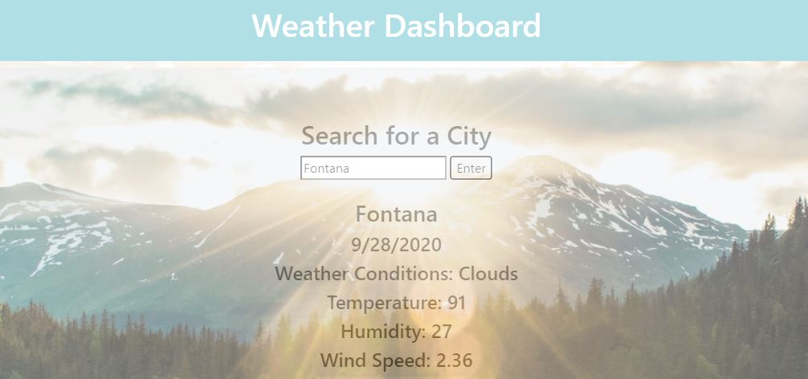

# Weather Dashboard

### Deployed Application 

[Weather Dashboard](https://areye022.github.io/weather-dashboard/)

### Description 
This application allows users to generate a 5-day forecast for a searched city.

When a city is searched, the user will be able to see the current temperature, humidity, windspeed, and weather conditions. 

### Features
* Utilized Openweathermap API to retrieve weather data and forecasts.. 
* Utilizes Bootstrap features such as jumbotron, cards, containers, etc.   
* Fynamically created HTML elements to create a clean HTML page. 